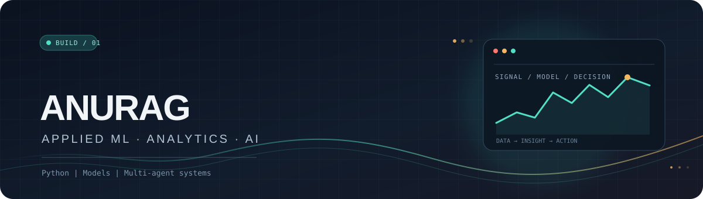

  

### Turning data into decisions, and ideas into working systems.

I build Python projects across **machine learning, analytics, and multi-agent AI** — from customer churn insights to research-driven financial tooling.

---

## ✦ What I’m building

| Project | Focus |
|:--|:--|
| [**Customer Churn Analytics Platform**](https://github.com/Anuragluck/Customer-churn-analytics-platform..) | Churn prediction with XGBoost, model explanations with SHAP, PostgreSQL scoring, SQL insights, and an interactive Streamlit app. |
| [**AI Hedge Fund**](https://github.com/Anuragluck/Ai-Hedge-Fund) | A multi-agent research workflow combining financial, technical, fundamental, sentiment, and risk analysis. |

## ⌘ Toolkit

## ↗ Find me

[GitHub profile](https://github.com/Anuragluck) · [Browse my projects](https://github.com/Anuragluck?tab=repositories)

  Curious by default. Building one useful thing at a time.

